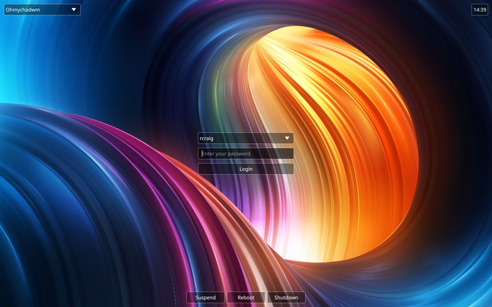

# Personal Recovery ISO Builder

Make a bootable USB/DVD image that is a **clone of your own running system** —
your installed programs, your settings, and your home folder — so that if your
disk dies you can put everything back on a new disk and carry on as if nothing
happened.

This is the Arch-world equivalent of MX Linux's *MX Snapshot*. It works on plain
**Arch**, **CachyOS**, and **Kiro**.



> Verified end-to-end: a system cloned into a recovery ISO, then restored onto a
> blank disk, boots all the way to its login screen — as shown above.

---

## How it works (the short version)

1. The script copies your live system into a temporary folder, leaving out
   junk and secrets (a list you can edit first).
2. It compresses that copy into a single file, `clone.sfs`.
3. It packs `clone.sfs` into a normal Arch live ISO using `mkarchiso`.

The finished ISO boots a plain, reliable Arch live environment. Your cloned
system rides along inside it as data. To put your system back, you simply boot
the ISO: the restore tool starts on its own after a short, cancelable countdown.

---

## What you need

- An Arch-based system (Arch, CachyOS, or Kiro).
- Free disk space of about **2.5 times** the size of your data. The script
  measures this for you and warns if you are short.
- Four software packages. The script checks for them and offers to install any
  that are missing:
  - `archiso` (provides the `mkarchiso` command that builds the ISO)
  - `arch-install-scripts` (provides `genfstab` and `arch-chroot`, used on restore)
  - `rsync` (copies your files)
  - `squashfs-tools` (provides `mksquashfs`, the compressor)

---

## Step 1 — Build the ISO

Open a terminal in the folder that holds `build-recovery-iso.sh`.

Run the build script with administrator rights. The word `sudo` means "run as
the system administrator"; it will ask for your password:

```
sudo ./build-recovery-iso.sh
```

The script will:

1. **Check the four packages** and offer to install any missing ones.
2. **Detect your boot setup** — UEFI or BIOS, systemd-boot or GRUB, where the
   EFI partition lives, whether your root is encrypted, and whether `/home` or
   `/boot` is on its own partition — so the restore can rebuild it correctly.
3. **Ask about secrets.** It first asks if the ISO is for your **personal use
   only**. If you say yes, it offers to **include your secrets** (SSH/GPG keys,
   saved logins, password stores, shell history) so the restored system is ready
   to use with nothing to set up again — no hand-editing required. If you say no,
   your secrets are left out, and you can still open the exclusion list in an
   editor to fine-tune it.
4. **Show the exclusion list** — everything that will be *left out* of the clone.
   **Read this carefully:** anything not on the list gets copied into the ISO.
5. **Ask three questions** — where to do the build work, where to save the
   finished `.iso`, and what to name it. Press **Enter** to accept each default.
6. **Clone, compress, and build.** When it finishes it prints the path to your
   `.iso`, a matching `.sha256` checksum file, a build log saved beside the ISO,
   and the total build time.

> **About secrets (important if you share the ISO).** By default the script
> leaves out SSH private keys, GPG keys, password stores, browser logins, cloud
> tokens, and shell history. The "personal use" question above is the easy way to
> include them; removing lines from the exclusion list by hand does the same
> thing. Either way, only include secrets in a recovery image you will keep
> **private** — anyone who gets the ISO could read them.

> **Faster builds (optional).** Compressing the clone is the slow step. By
> default it uses a fast setting (zstd level 3). For an even quicker build at the
> cost of a larger ISO, set the level (1 is fastest) when you start the script:
>
> ```
> sudo CLONE_ZSTD_LEVEL=1 ./build-recovery-iso.sh
> ```

---

## Step 2 — Write the ISO to a USB stick

Plug in a USB stick that you do not mind erasing (8 GB or larger).

Find its device name. The following command lists your disks and their sizes so
you can identify the stick:

```
lsblk -dpno NAME,SIZE,MODEL
```

Suppose the stick is `/dev/sdX` (replace `sdX` with the real name — getting this
wrong erases the wrong disk). Write the ISO to it. Here `if=` is the input file
and `of=` is the output device; `status=progress` shows a progress bar:

```
sudo dd if=your-recovery.iso of=/dev/sdX bs=4M status=progress oflag=sync
```

---

## Step 3 — Restore onto a new disk

Boot the target machine from the USB stick (use the firmware boot menu). You
arrive at a plain Arch live environment, logged in as `root`, and the restore
tool **starts automatically** after a 10-second countdown. (Press any key during
the countdown to cancel and get a normal shell instead; you can start the tool
by hand at any time by running the command below.)

```
/root/restore-system.sh
```

It walks you through everything:

1. **Verifies** the clone is undamaged (checks its `.sha256`) **before touching
   any disk**.
2. **Shows a numbered list of disks** and asks you to pick one by number — no
   typing device paths. The USB stick you booted from is left off the list so you
   cannot wipe it by mistake.
3. **Checks the disk is big enough** for your clone *before* erasing anything, so
   a too-small disk is refused instead of being wiped and then failing.
4. **Asks about encryption.** If your source system used LUKS encryption it
   offers to encrypt the new disk the same way; if it did not, it offers to add
   encryption anyway. Choose, and (if yes) enter a passphrase.
5. **Shows the plan and asks you to type `ERASE`** to confirm — the chosen disk
   is then wiped completely.
6. Partitions and formats the disk (recreating a separate `/home` or `/boot` if
   your original had one), unpacks your clone onto it, writes a fresh
   `/etc/fstab`, rebuilds the boot images, and reinstalls the matching bootloader.
7. **Offers to reboot or power off** when it finishes, reminding you to remove the
   USB stick first.

Your system comes back up as it was.

> **Heads-up on encryption and unusual layouts.** Two cases are proven
> end-to-end (build → restore → boots to login): the plain single unencrypted
> root, and an **encrypted (LUKS) root with a separate encrypted `/home`** on a
> systemd-boot system. A separate **`/boot`** partition and the GRUB-on-encrypted
> path are not yet verified — see Limitations.

---

## Limitations

- **LUKS encryption with a separate `/home`** is verified on systemd-boot. A
  separate **`/boot`** partition is **not yet verified** — and on systemd-boot a
  separate ext4 `/boot` cannot work anyway (the boot firmware only reads FAT), so
  that layout is really a GRUB case and is left for a later round.
- **GRUB on an encrypted disk** is handled on a best-effort basis — if you use
  GRUB *and* encryption, check `/etc/default/grub` on the restored system.
- The restore assumes the **target machine's firmware matches the source's**
  (both UEFI, or both BIOS). Restoring a UEFI clone onto a BIOS-only machine, or
  vice versa, is not handled.

---

## Files in this folder

- `build-recovery-iso.sh` — the build script you run.
- `recovery-exclude.list` — the editable list of what to leave out. It is created
  automatically the first time you run the build script.
- `restore-system.sh` — the restore tool. You do **not** run this here; the build
  script writes a copy of it into the ISO.
